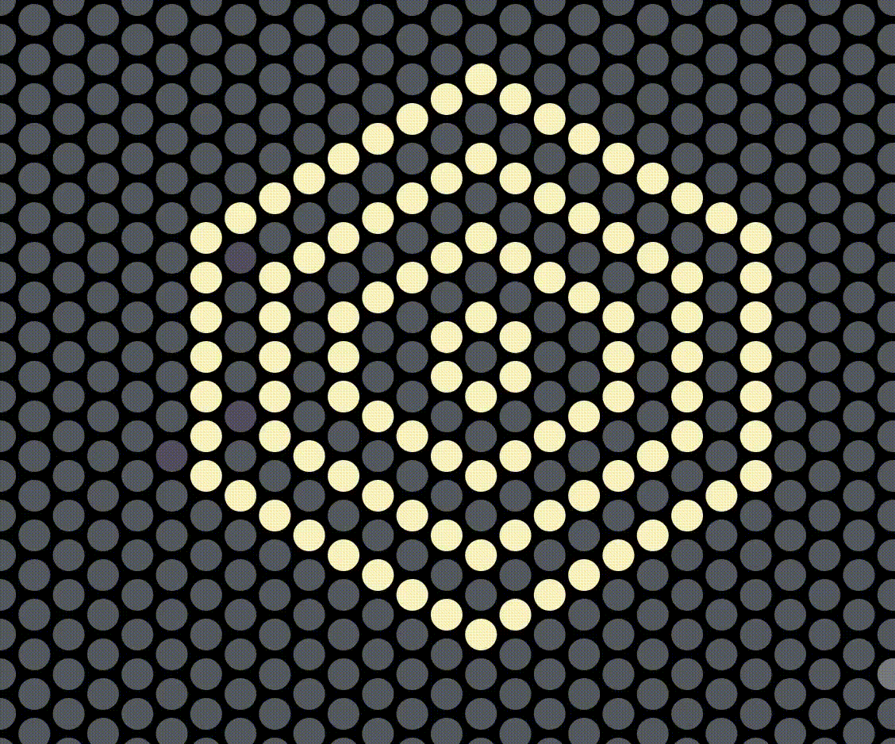

# Circle Tile Array P5.JS

- Adding .protoype to attach methods to objects. All objects in JavaScript have a prototype. An object’s prototype is also considered to be an object.

- .prototype chain. By default, the JavaScript engine provides the Object() function and an anonymous object that can be referenced via the Object.prototype.

- .prototypal inheritence. When it comes to inheritance, JavaScript only has one construct: objects. Each object has a private property which holds a link to another object called its prototype. That prototype object has a prototype of its own, and so on until an object is reached with null as its prototype. By definition, null has no prototype, and acts as the final link in this prototype chain.

